# CS2100 Visualizer

**Interactive web app for learning CS2100 topics through visual simulation: MIPS datapath execution, MIPS assembly, Karnaugh maps, and MIPS pipelining.**

**Team 6644 | Apollo 11 Target**

**Authors:** Nguyen Duc Thang, Lai Minh Quang

## Demo

[CS2100 Visualizer Demo](https://cs2100-visualizer.vercel.app/)

## Proposed Level of Achievement

Target: **Apollo 11**

## Table of Contents

1. [Project Overview](#1-project-overview)
2. [Motivation](#2-motivation)
3. [Vision](#3-vision)
4. [Target Users](#4-target-users)
5. [User Stories](#5-user-stories)
6. [Scope and Feature Status](#6-scope-and-feature-status)
7. [Technical Proof of Concept](#7-technical-proof-of-concept)
8. [Features](#8-features)
9. [System Design](#9-system-design)
10. [Code Structure](#10-code-structure)
11. [Key Design Decisions](#11-key-design-decisions)
12. [Software Engineering Practices](#12-software-engineering-practices)
13. [Testing Strategy](#13-testing-strategy)
14. [Limitations and Challenges](#14-limitations-and-challenges)
15. [Timeline and Development Plan](#15-timeline-and-development-plan)
16. [Quick Start](#16-quick-start)
17. [Tech Stack](#17-tech-stack)
18. [Project Log and Repository](#18-project-log-and-repository)

# 1. Project Overview

CS2100 Visualizer is our Orbital project for making CS2100 topics easier to understand visually. Instead of only reading static diagrams, students can step through datapath execution, run small MIPS programs, practise K-maps, and compare pipeline timings.

The project currently contains four learning modules:

1. **MIPS Datapath Visualizer** — stage-by-stage single-cycle datapath execution.
2. **MIPS Assembly Simulator** — instruction-level MIPS assembly parsing, encoding, and execution.
3. **K-map Visualizer** — Boolean simplification practice through editable Karnaugh maps, manual grouping, solver comparison, and expression checking.
4. **MIPS Pipeline Visualizer** — cycle-by-cycle pipeline timing, stalls, flushes, hazards, forwarding, branch prediction, and CPI.

The app is designed as a browser-based learning tool. It does not require accounts, backend storage, or installation. Students can directly open the demo, choose a module, and interact with CS2100 concepts visually.

# 2. Motivation

CS2100 introduces important computer organization concepts such as MIPS assembly, single-cycle datapath execution, control signals, register and memory updates, Boolean simplification, and pipelining. These concepts are often taught through static diagrams, tables, and final-answer examples.

However, static diagrams do not show how values move through the processor, how control signals affect datapath routing, or how intermediate values change step by step. For example, students may know that `lw` uses `ALUSrc`, `MemRead`, `MemToReg`, and `RegWrite`, but still struggle to visualize how the immediate becomes an address, how data memory is read, and how the loaded value is written back to the register file.

Similarly, for Karnaugh maps, students may know the final simplified expression but still not fully understand why certain groups are valid, why wrap-around groups work, or how a group becomes a Boolean term.

For pipelining, students often manually draw stage-time tables and compute cycles, stalls, and CPI. This is error-prone because instruction dependencies, forwarding assumptions, branch resolution, prediction, and loops interact with each other.

CS2100 Visualizer makes these hidden intermediate steps visible. Instead of only reading diagrams, students can interact with instructions, signals, memory, registers, K-map cells, groups, solver output, and pipeline timelines directly.

# 3. Vision

CS2100 Visualizer aims to become a focused study tool for core CS2100 topics.

The vision is not to replace lectures or tutorials. Instead, the app supplements them by providing visual, interactive, and correctness-aware practice workflows.

The app should help students:

- connect abstract CS2100 diagrams to concrete execution behavior
- inspect intermediate states instead of only seeing final answers
- experiment with inputs, control signals, and program behavior
- compare their manual reasoning against simulator or solver output
- revise quickly before tutorials, quizzes, and exams

The long-term direction is to cover more CS2100 topics through small, accurate visual modules rather than one large monolithic simulator.

# 4. Target Users

## 4.1 Primary Users

The primary users are **CS2100 students** learning:

- MIPS instructions
- single-cycle datapath
- control signals
- register and memory behavior
- assembly execution
- Karnaugh maps
- 5-stage MIPS pipelining

## 4.2 Secondary Users

Secondary users include:

- tutors and teaching assistants
- students revising before exams
- students who prefer visual learning
- students doing quick revision
- students who want to verify their manual answers

## 4.3 User Needs

The app is designed to help students:

- see how data moves through hardware
- observe intermediate values, not just final outputs
- connect assembly code to machine state
- understand how control signals affect execution
- practise K-map simplification interactively
- compare pipeline configurations such as forwarding, branch resolution, prediction, and jump handling
- learn from mistakes through logs, warnings, and visual feedback

# 5. User Stories

## 5.1 Datapath Visualizer

- As a CS2100 student, I want to step through IF, ID, EX, MEM, and WB so that I can understand what each stage does.
- As a CS2100 student, I want active datapath wires to be highlighted so that I can trace data movement.
- As a CS2100 student, I want to inspect values inside components so that I can understand what each component receives and outputs.
- As a CS2100 student, I want to edit control signals so that I can see how incorrect signals affect execution.
- As a CS2100 student, I want execution logs and warnings so that I can understand unexpected behavior.
- As a TA, I want a visual tool that helps explain datapath execution during teaching.

## 5.2 Assembly Simulator

- As a CS2100 student, I want to write MIPS assembly and assemble it into machine code.
- As a CS2100 student, I want to step through instructions one at a time.
- As a CS2100 student, I want to see PC, register, and memory updates after each instruction.
- As a CS2100 student, I want labels in branches and jumps to be resolved correctly.
- As a CS2100 student, I want register and memory highlights so that I can see which values are read and written.

## 5.3 K-map Visualizer

- As a CS2100 student, I want to edit K-map cells so that I can create Boolean functions.
- As a CS2100 student, I want to use 2-variable, 3-variable, and 4-variable K-maps.
- As a CS2100 student, I want to manually group cells so that I can practise simplification.
- As a CS2100 student, I want to compare my groups with solver groups.
- As a CS2100 student, I want to check whether my Boolean expression is correct.
- As a CS2100 student, I want practice maps with different difficulty levels.
- As a TA, I want a visual tool that helps explain K-map grouping and simplification during teaching.

## 5.4 Pipeline Visualizer

- As a CS2100 student, I want to see instructions move across pipeline stages over cycles.
- As a CS2100 student, I want stalls, bubbles, and flushes to be clearly shown.
- As a CS2100 student, I want hazards and forwarding to be visualized in a timeline.
- As a CS2100 student, I want to compare cycle counts under different pipeline assumptions.
- As a CS2100 student, I want to understand pipeline behavior without manually tracking every stage on paper.
- As a TA, I want a visual tool that helps explain pipeline timing and hazards during teaching.

# 6. Scope and Feature Status

## 6.1 Current Modules

### MIPS Datapath Visualizer

The Datapath Visualizer makes single-cycle execution visible stage by stage. It shows IF, ID, EX, MEM, and WB behavior so students can trace how values move through the datapath.

### MIPS Assembly Simulator

The Assembly Simulator is for quickly testing supported MIPS programs. It assembles source code into machine code and executes one instruction at a time.

### K-map Visualizer

The K-map Visualizer supports manual Boolean simplification practice. It includes editing, grouping, solver comparison, expression checking, and generated practice maps.

### MIPS Pipeline Visualizer

The Pipeline Visualizer shows cycle-by-cycle instruction overlap. It covers stage placement, stalls, bubbles, flushes, forwarding, branch behavior, jump handling, and CPI.

## 6.2 Planned Modules

### Cache Visualizer

A planned Milestone 3 module for visualizing cache hits, misses, tags, index, offset, memory blocks, replacement behavior, and locality.

### Pipeline Datapath Visualization

A full pipelined datapath renderer is not planned as a core feature. It may be considered only if time permits.

## 6.3 Feature Status Summary

| Feature                         | Status                  | Notes                                                                      |
| ------------------------------- | ----------------------- | -------------------------------------------------------------------------- |
| MIPS Datapath Visualizer        | Implemented             | Stage-by-stage single-cycle datapath execution                             |
| Editable Control Signals        | Implemented             | Users can override runtime control signals                                 |
| Component Inspector             | Implemented             | Supports major datapath components and MUXes                               |
| Register / Memory Simulation    | Implemented             | Supports editable state and simulation mode                                |
| Execution Logs and Warnings     | Implemented             | Explains stage behavior and invalid signal cases                           |
| MIPS Assembly Simulator         | Implemented             | Supports parsing, label resolution, hex output, and stepping               |
| K-map Visualizer                | Implemented             | Supports editing, grouping, solver comparison, checking, and practice      |
| MIPS Pipeline Visualizer        | Implemented             | Timeline, dynamic traces, stalls, flushes, forwarding, prediction, and CPI |
| Automated Tests                 | Implemented             | Uses Vitest for MIPS, datapath, K-map, and pipeline core logic             |
| Cache Visualizer                | Planned for Milestone 3 | Hits, misses, tags, index, offset, blocks, and replacement                 |
| Pipeline Datapath Visualization | Stretch only            | Not part of core scope                                                     |

# 7. Technical Proof of Concept

The GIFs and annotated screenshots in the feature sections provide visual evidence for the working modules.

## 7.1 Datapath Visualizer PoC

The datapath visualizer proof of concept shows:

1. selecting a supported MIPS instruction
2. generating default control signals
3. stepping through IF, ID, EX, MEM, and WB
4. highlighting active datapath paths
5. updating datapath values, registers, memory, logs, and warnings
6. editing control signals
7. inspecting datapath components

## 7.2 Assembly Simulator PoC

The assembly simulator proof of concept shows:

1. writing supported MIPS assembly
2. assembling into machine code
3. resolving labels
4. stepping through instruction execution
5. updating PC, register, and memory state
6. highlighting instruction inputs and outputs

## 7.3 K-map Visualizer PoC

The K-map visualizer proof of concept shows:

1. editing K-map values
2. inputting minterms, don't-cares, or Boolean expressions
3. creating manual groups
4. comparing against solver-generated groups
5. checking simplified expressions
6. generating practice maps

## 7.4 Pipeline Visualizer PoC

The pipeline visualizer proof of concept shows:

1. entering or loading a MIPS program
2. setting initial register and memory values
3. generating the dynamic execution trace
4. rendering the IF/ID/EX/MEM/WB stage-time diagram
5. showing stalls, bubbles, flushes, and forwarding arrows
6. comparing forwarding, branch resolution, branch prediction, and jump handling options
7. inspecting per-instruction stage behavior and stall reasons
8. updating CPI, cycle count, instruction count, stall count, and flush count

# 8. Features

## 8.1 MIPS Datapath Visualizer

The datapath visualizer lets users step through selected MIPS instructions across IF, ID, EX, MEM, and WB. It shows how values move through a single-cycle datapath, how control signals affect execution, and why different instruction types activate different hardware paths.

The current datapath visualizer supports:

`add`, `addi`, `and`, `beq`, `bne`, `lw`, `slt`, `or`, `sw`, and `sub`.

The supported set is intentionally smaller than the Assembly Simulator. The Assembly Simulator can support more instructions because it executes each instruction at the semantic level: parse the instruction, update PC/registers/memory, and show the resulting state. The Datapath Visualizer has a stricter requirement: every supported instruction must have accurate IF / ID / EX / MEM / WB stage behavior, correct control-signal behavior, meaningful intermediate datapath values, and visible SVG path highlighting. For this reason, we kept the datapath module to a smaller set of representative instructions instead of claiming full assembly-level instruction coverage.

Implemented:

- instruction setup
- command/status header
- control-signal table
- editable control signals
- IF / ID / EX / MEM / WB stepping
- previous/reset support
- register table
- memory table
- datapath value table
- execution log
- warnings panel
- component inspector
- dynamic SVG wire highlighting
- Explore, Simulate, and Assembly modes

At first, we tried to highlight SVG wires directly from the datapath logic, but this quickly became hard to maintain. A single logical connection such as `PC_TO_IM` can correspond to multiple SVG line segments on the diagram, so we split logical datapath paths from the actual SVG rendering.

This avoided mixing simulator correctness with diagram coordinates. The simulator only needs to say which route is active, while the renderer decides which visible wire segments should light up.

The module also has to handle edited control signals carefully. A wrong signal should not silently disappear or produce misleading output; it should either affect the simulated behavior or be surfaced through warnings. One issue we checked manually was `lw` with an unaligned address, where the warning panel had to make the problem clear instead of letting the memory stage look normal. Automated tests cover stage transitions, control-signal behavior, invalid signal cases, path highlighting, inspector output, and machine-state updates.

Demo:


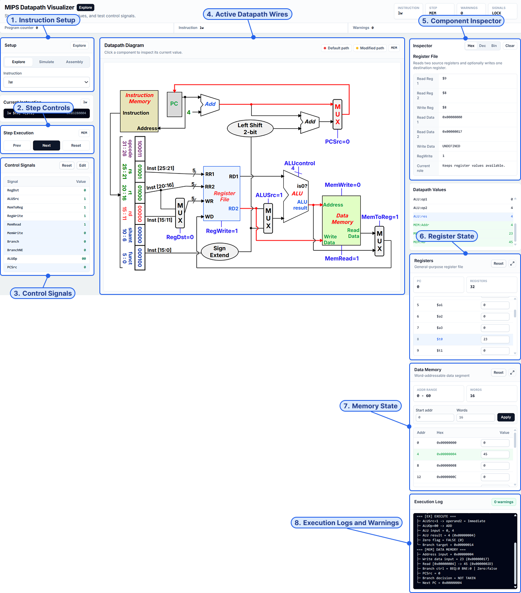

## 8.2 MIPS Assembly Simulator

The assembly simulator lets users write MIPS programs, assemble them into machine code, and step through execution one instruction at a time. The instruction-level view is faster for checking PC, register, and memory changes than opening the full datapath view for every instruction.

The Assembly tab supports the currently implemented 17-instruction set:

`add`, `addi`, `and`, `andi`, `beq`, `bne`, `j`, `lui`, `lw`, `nor`, `or`, `ori`, `slt`, `sll`, `srl`, `sw`, and `sub`.

The Assembly Simulator supports a broader instruction set than the Datapath Visualizer because it executes instructions at the instruction-semantics level rather than visualizing every datapath path, control signal, and intermediate stage.

Implemented:

- assembly text input
- parser
- label handling
- branch and jump target resolution
- 32-bit hex machine-code output
- instruction-level stepping
- PC updates
- register updates
- memory updates
- input/output highlighting
- reset after loading
- send-to-pipeline integration

The parser was one of the more bug-prone parts because each instruction format has slightly different operands, and branches/jumps need labels to resolve correctly. PC updates also require care because sequential instructions, taken branches, untaken branches, and jumps all update control flow differently.

This module shares MIPS logic with the Pipeline Visualizer, so consistency matters. Automated tests cover supported instruction parsing, invalid syntax handling, label resolution, machine-code encoding, instruction execution, and PC/register/memory updates. Manual testing checks whether the editor, generated machine-code table, highlights, and state panels update clearly after each step.

Demo:

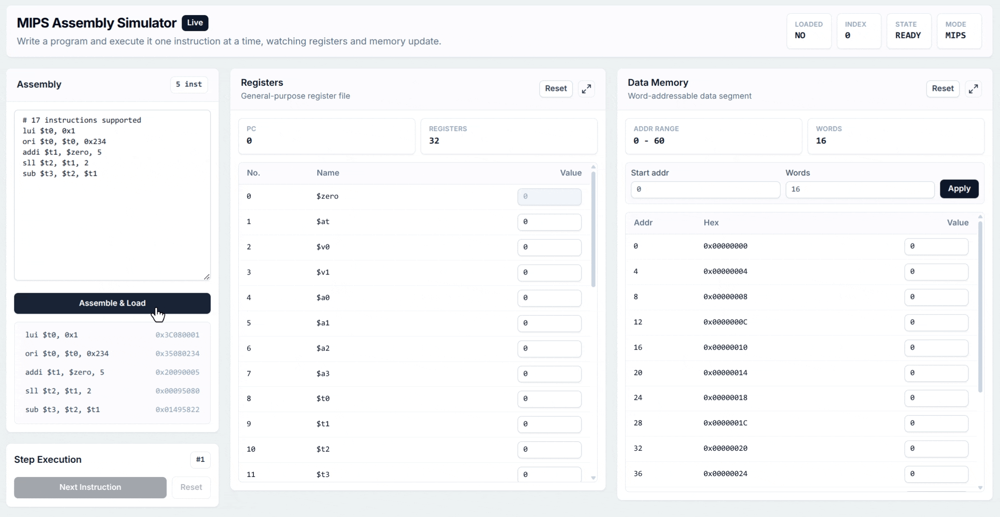


## 8.3 K-map Visualizer

The K-map visualizer supports Boolean simplification through editable maps, manual groups, solver comparison, and expression checking. It supports 2-variable, 3-variable, and 4-variable K-maps, including don't-care terms.

Implemented:

- 2-variable K-map
- 3-variable K-map
- 4-variable K-map
- editable `0 / 1 / X` cells
- minterm input
- don't-care input
- Boolean expression input
- SOP/POS modes
- manual grouping workflow
- solver grouping view
- expression checker
- practice-map generation

K-map bugs were not only about drawing boxes in the right place. Wrap-around groups need special handling, don't-care cells can help simplify an expression without needing to be covered, and expression checking has to test logical equivalence instead of comparing strings. For example, two answers can look different but still represent the same Boolean function.

Manual groups and solver groups are kept separate so students can attempt the problem before comparing against the app's solution. Tests cover K-map model creation, minterm and don't-care mapping, Gray-code layout behavior, group validation, solver output, practice-map generation, and expression checking. We also manually checked the K-map workflow against finals/tutorial problems by hand, and it passed those checks.

Keeping these two workflows separate makes the app feel more like a practice tool than an answer reveal. During user testing, the solver comparison was useful, but manual group clearing was not obvious enough, so that became one of the polish items.

Demo:

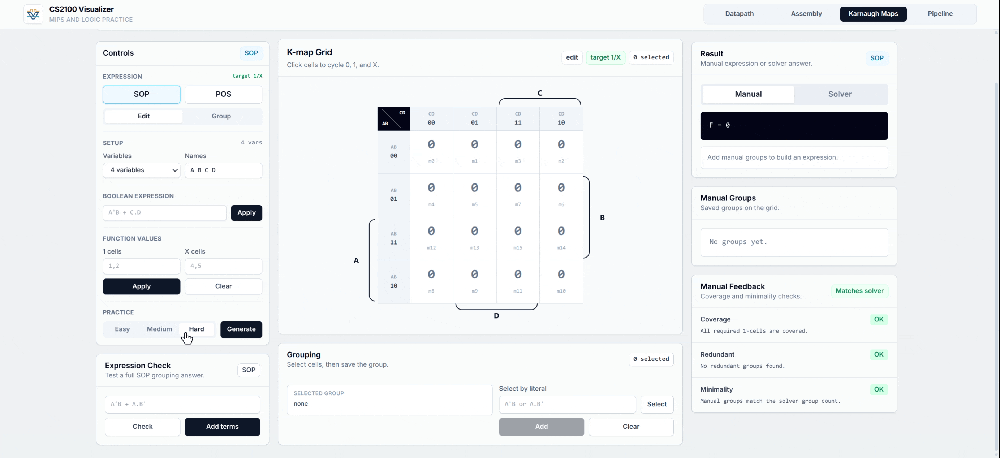

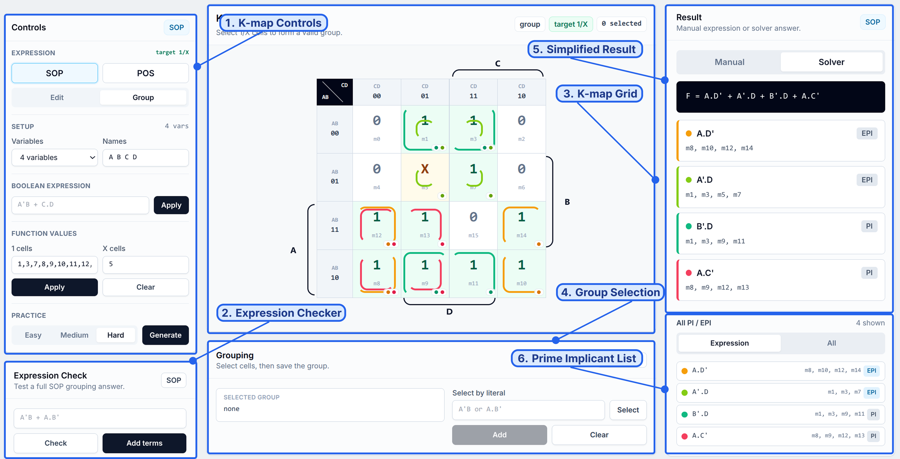

## 8.4 MIPS Pipeline Visualizer

The pipeline visualizer shows how MIPS instructions overlap across a 5-stage pipeline. Users can compare cycle counts under different assumptions such as forwarding, branch resolution stage, branch prediction, and jump handling.

The Pipeline Visualizer uses the same MIPS assembly subset as the Assembly Simulator, through the shared assembler and instruction executor.

Implemented:

- editable MIPS program input
- presets for default, ALU chain, load-use, loop, and jump examples
- assembly error reporting while typing
- execution trace generation from real instruction semantics
- loop unrolling up to a configurable row limit
- configurable row and cycle display limits
- initial register and memory editing for input-dependent branches
- cycle-by-cycle stage-time diagram
- bubble markers before delayed instructions
- forwarding arrows for forwarded dependencies
- counters for cycles, instruction count, CPI, stalls, and flushes
- selectable instruction rows with stage explanations
- stall-reason panel with course-style delay cases
- branch prediction toggle with taken/not-taken mode
- forwarding toggle
- early-branch toggle
- jump-in-ID toggle
- send-to-pipeline integration from the Assembly Simulator

We modeled the hazard logic around common CS2100-style pipeline assumptions:

- RAW dependencies without forwarding wait until the producer reaches write-back.
- RAW dependencies with forwarding can consume ALU results earlier.
- Load-use dependencies with forwarding still require one bubble because load data is available after MEM.
- Branches can resolve in ID or MEM, producing different control penalties.
- With prediction enabled, correct branch guesses add no control penalty and wrong guesses flush by the configured branch penalty.
- Jumps can resolve in ID or MEM through the `jumpInId` option.

One issue we ran into was deciding whether the timeline should schedule static source lines or the instructions that actually execute. Static scheduling is simpler, but it breaks down for loops and taken branches because the written program is not always the executed trace.

We now execute the program first with the shared Assembly Simulator logic, then pass the dynamic trace into the pipeline scheduler. This made branch outcomes, loop iterations, and register/memory-dependent control flow match the assembly view before stages are placed on the timeline.

Another boundary we had to watch was keeping the model close to CS2100 questions without turning it into a full CPU simulator. Tests cover hazard scheduling, forwarding behavior, load-use stalls, branch penalties, jump penalties, prediction settings, loop traces, and cycle-count behavior. We also manually checked the pipeline output against selected finals/tutorial problems by hand, and it passed those checks. Manual testing checks that the stage-time table, counters, bubbles, flushes, forwarding arrows, and instruction inspector remain visually understandable.

Demo:

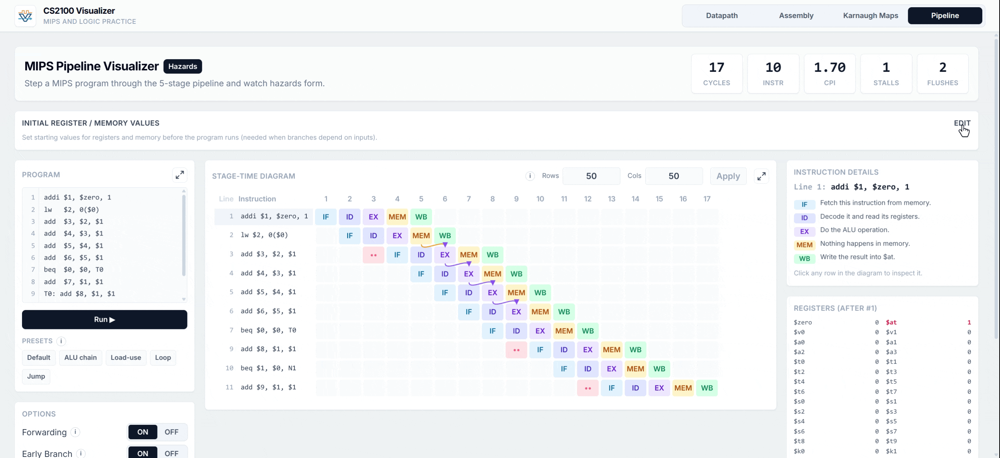

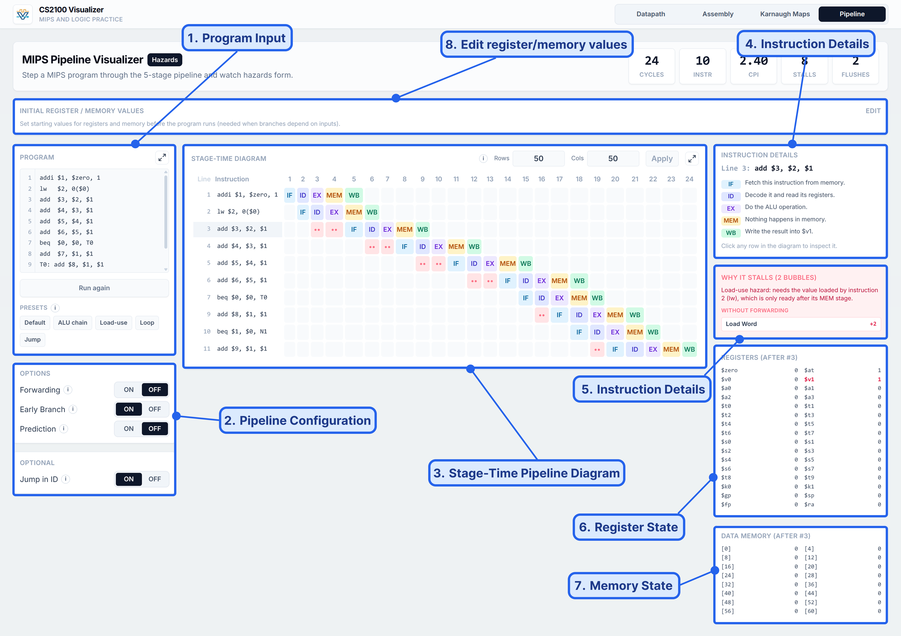

## 8.5 Example Learning Workflows

The four modules are organized around short, repeatable learning workflows rather than one long fixed tutorial.

### Datapath Revision Workflow

A student can start with a simple instruction such as `add $t0, $t1, $t2`, step through IF, ID, EX, MEM, and WB, and watch which datapath wires become active at each stage.

After that, the student can switch to a memory instruction such as `lw` or `sw` and compare how the control signals and active paths change.

The editable control-signal mode also lets students intentionally create incorrect cases. For example, turning off `RegWrite` for an arithmetic instruction shows why the register file is not updated even if the ALU result is correct.

### Assembly Debugging Workflow

A student can write a short MIPS program, assemble it, and step through the program instruction by instruction.

The simulator highlights register and memory changes after each step.

Because labels are resolved by the assembler, branch and jump examples can be tested in a way that is closer to real assembly programming than isolated instruction examples.

### K-map Practice Workflow

A student can generate or enter a Boolean function, manually create groups, and compare the result with solver-generated groups.

This supports a useful learning sequence:

1. Try to solve the K-map manually.
2. Check whether the resulting expression is equivalent.
3. Compare manual groups against solver groups.
4. Adjust groups and expressions based on the feedback.

### Pipeline Comparison Workflow

A student can load a preset program and toggle forwarding, early branch resolution, branch prediction, and jump handling.

The stage-time table and counters update immediately, allowing students to compare CPI, cycle count, stalls, and flushes under different assumptions.

## 8.6 Concrete Example Scenarios

### Example: `lw` in the Datapath Visualizer

For `lw $t0, 4($t1)`, the student can watch the instruction move through the same five stage labels used in CS2100: IF, ID, EX, MEM, and WB.

The useful learning points are:

- IF shows the instruction fetch path.
- ID shows register reads and immediate extraction.
- EX shows address calculation using the base register and offset.
- MEM shows the data memory read.
- WB shows the loaded value being written back to the destination register.

`lw` is a compact example because it touches control signals, ALU input selection, data memory access, and register write-back in one instruction.

### Example: Branches in the Assembly and Pipeline Modules

For a short program with `beq` or `bne`, the Assembly Simulator shows whether the branch is taken by updating the PC and highlighting the relevant register reads.

The Pipeline Visualizer then uses the executed trace to show how the same branch affects timing. This is where students can compare branch resolved in ID vs MEM, prediction off vs prediction on, and predicted taken vs predicted not taken.

Showing both views makes the control-flow effect more concrete than showing only a final PC value or only a pipeline penalty.

### Example: K-map Solver Comparison

For a K-map with several possible valid groupings, the student can first create manual groups and then reveal solver groups.

The solver is not treated as the only “real” solution. Some Boolean functions can be simplified through different valid group choices, so the tool checks equivalence and group validity instead of only expecting one visual answer.

### Example: Load-use Hazard in the Pipeline Visualizer

For a program such as:

```mips
lw   $t0, 0($t1)
add  $t2, $t0, $t3
```

the Pipeline Visualizer can show why forwarding does not remove every stall. The loaded value is only available after MEM, so the dependent instruction still needs a bubble in the common CS2100 model.

The visual timeline makes this exception easier to see.

# 9. System Design

CS2100 Visualizer is a client-side React application. The system is organised around four independent learning modules: Datapath, Assembly, K-map, and Pipeline. Each module has its own page-level UI and state management, while the logic that decides the actual answers is kept in `core/` folders so it can be reused and tested independently.

## 9.1 Overall Architecture

The system follows a feature-based frontend structure with a shared core-logic layer.

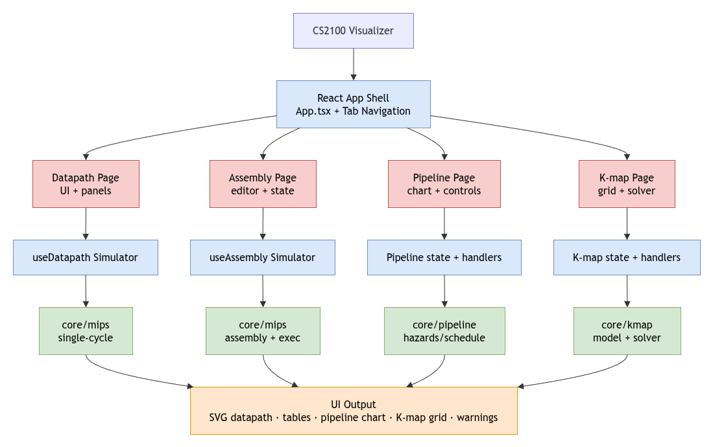

In the code, this means page components mostly handle controls, selected rows, highlighted cells, and rendered diagrams. The actual parsing, simulation, solving, and scheduling live outside the React components.

## 9.2 Shared MIPS Core

The Datapath, Assembly, and Pipeline modules share MIPS-related logic where appropriate.

The shared MIPS core includes the parser and label resolver, instruction metadata, register utilities, machine-code encoder, instruction-level executor, single-cycle datapath logic, and pipeline trace generator.

The Assembly Simulator uses the shared MIPS parser and executor to run complete instructions. The Pipeline Visualizer also uses the executor to generate a dynamic instruction trace before scheduling pipeline stages. The Datapath Visualizer uses a smaller subset of MIPS instructions because it must represent each instruction through the staged single-cycle datapath UI.

This matters most for Assembly and Pipeline. A branch or `lw` instruction should execute the same way before the pipeline scheduler starts placing stages on the timeline.

## 9.3 Datapath Visualizer Design

The Datapath Visualizer models single-cycle datapath execution as a staged learning workflow.

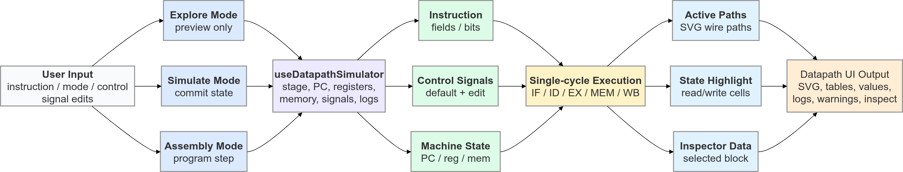

The SVG datapath is kept separate from the simulation logic. Core logic refers to logical paths such as `PC_TO_IM`, while the SVG renderer expands those paths into visible wire segments. When we move or redraw a wire, the datapath execution rule does not need to change.

## 9.4 Assembly Simulator Design

The Assembly Simulator is an instruction-level execution module. Unlike the Datapath Visualizer, it does not show IF/ID/EX/MEM/WB stages. Instead, each step executes one complete instruction and updates the machine state.

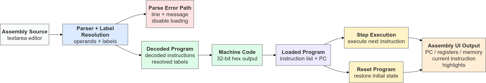

The Assembly Simulator supports a broader instruction set than the Datapath Visualizer because it executes instruction semantics directly. This allows students to test small MIPS programs, observe state updates, and then use selected instructions in the Datapath or Pipeline modules.

## 9.5 K-map Visualizer Design

The K-map Visualizer is designed around two parallel learning workflows: manual solving and solver comparison.

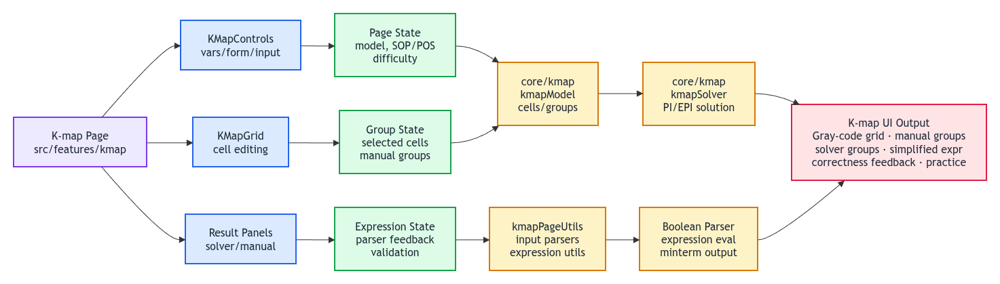

Manual groups and solver groups are kept separate so students can practise their own reasoning before comparing against the app’s solution. Don’t-care cells are handled as optional cells that can help form larger groups but do not need to be covered.

## 9.6 Pipeline Visualizer Design

The diagram below shows how the Pipeline Visualizer connects program input, trace generation, hazard scheduling, and timeline rendering.

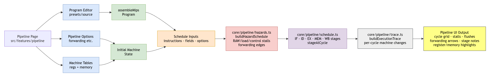

The module supports common CS2100-style pipeline assumptions:

- forwarding on or off
- branch resolved in ID or MEM
- prediction off or on
- predict taken or predict not taken
- jump resolved in ID or MEM

## 9.7 Cross-module Integration

Although the modules are presented as separate tabs, they are connected through shared concepts and shared core logic.

The Assembly Simulator and Pipeline Visualizer both use the MIPS parser and instruction executor. This means a program that is accepted by the Assembly Simulator can also be used as pipeline input, subject to the current supported instruction subset.

We keep the Datapath Visualizer to a smaller instruction set because each instruction must be represented visually through datapath stages and highlighted paths. For example, supporting `lw` means showing the base register read, immediate offset, ALU address calculation, memory read, and write-back path correctly, not just updating a register at the end.

The K-map Visualizer is independent from the MIPS modules, but it follows the same design principle: interactive UI state is kept separate from the solver and checker logic. The solver and checker can be tested from minterm and group data directly, without needing to click cells in the browser.

## 9.8 Data Flow Summary

| Area     | Input                              | Core Processing                           | Output Shown to User                                      |
| -------- | ---------------------------------- | ----------------------------------------- | --------------------------------------------------------- |
| Datapath | selected instruction, signal edits | staged datapath execution and highlights  | active wires, control signals, values, registers, memory  |
| Assembly | MIPS source code                   | parsing, label resolution, encoding       | machine code, PC changes, register and memory updates     |
| K-map    | minterms, don't-cares, expression  | model updates, group validation, solving  | K-map grid, groups, simplified expression, feedback       |
| Pipeline | MIPS source and pipeline options   | dynamic trace generation, hazard schedule | stage-time table, stalls, flushes, forwarding, CPI values |

This table also matches how we debugged the modules. When a pipeline cycle count looked wrong, we checked trace generation first, then hazard scheduling, then the rendered stage-time table. For K-maps, we could check the minterm/group data before looking at the grid drawing.

## 9.9 State and Feedback Design

We designed each module so that user input changes visible state immediately where possible.

In the Datapath Visualizer, stepping changes the current stage, highlighted paths, datapath values, and sometimes machine state. We separate Explore and Simulate mode because students sometimes want to inspect a datapath path without committing register or memory updates.

In the Assembly Simulator, stepping changes the PC, register table, memory table, and highlighted inputs/outputs. We keep a step history because backward stepping is useful when students want to compare before and after states.

In the K-map Visualizer, cell edits, manual groups, solver groups, and expression checks are kept as related but separate pieces of state. This prevents a simple map edit from accidentally erasing a student's manual reasoning unless the workflow explicitly resets it.

In the Pipeline Visualizer, program text, initial register/memory values, scheduling options, row limits, and cycle limits all affect the rendered timeline. We keep these as explicit controls because a small assumption change, such as resolving branches in ID instead of MEM, can change the cycle count.

Across the app, the feedback style is intentionally direct: warnings, highlights, and counters are shown near the UI element they explain. In practice, this helped most when something looked surprising, such as a branch changing PC, a pipeline row getting delayed, or a K-map group being rejected.

# 10. Code Structure

The main source code lives in `src/`, with feature UI under `src/features/`, shared simulator and solver logic under `src/core/`, reusable UI components under `src/components/`, common types under `src/types/`, and documentation media under `docs/assets/` and `docs/diagrams/`.

Important files:

- `src/App.tsx` — top-level app shell and tab switching.
- `src/features/datapath/DatapathPage.tsx` — main datapath visualizer UI.
- `src/features/datapath/hooks/useDatapathSimulator.ts` — datapath state, stepping, modes, control signals, and machine state.
- `src/features/datapath/components/DatapathDiagram.tsx` — datapath SVG wrapper and highlight mapping.
- `src/features/datapath/components/StaticDatapathSvg.tsx` — static SVG datapath drawing and clickable hit boxes.
- `src/features/assembly/AssemblyPage.tsx` — standalone assembly simulator UI.
- `src/features/assembly/useAssemblySimulator.ts` — instruction-level assembly simulation state.
- `src/features/kmap/KMapPage.tsx` — K-map visualizer UI.
- `src/features/pipeline/PipelinePage.tsx` — pipeline timeline UI, controls, presets, counters, and inspector.
- `src/core/mips/assembly/` — MIPS parsers and assemblers.
- `src/core/mips/execution/` — instruction-level MIPS execution logic.
- `src/core/mips/instruction/` — instruction metadata, register names, encoders, and examples.
- `src/core/mips/single-cycle/` — datapath control, execution, diagram paths, highlights, inspector logic, and machine state.
- `src/core/kmap/` — K-map model, solver, practice generator, and manual group analysis.
- `src/core/pipeline/` — pipeline trace generation, scheduling, hazard detection, forwarding edges, and pipeline tests.

# 11. Key Design Decisions

## 11.1 Separate Learning Modules

Datapath, Assembly, K-map, and Pipeline are separated because each module has a different learning workflow.

Keeping the pages separate also made development easier. A K-map grouping bug did not affect pipeline controls, and a pipeline scheduling change did not risk breaking the datapath stepper UI.

## 11.2 Core Logic Separated from UI

Simulation, solving, and scheduling logic are kept in `core/` folders instead of being embedded directly inside React components.

This improves:

- testability
- readability
- reusability
- separation of concerns
- future extension across modules

## 11.3 SVG for Datapath Rendering

SVG was chosen over Canvas because datapath components and wires can be named, styled, highlighted, and clicked individually.

For a fixed CS2100-style datapath, this makes each wire and component easier to target, highlight, and inspect.

## 11.4 Signal-based Datapath Simulation

Control signals are represented explicitly so students can see how changing a signal changes datapath behavior.

This supports both correct execution and incorrect-signal exploration.

## 11.5 Logical Paths vs SVG Segments

We separated logical datapath paths from SVG drawing segments because simulation correctness and diagram layout changed at different times during development.

For example, the simulator can refer to a high-level path such as `PC_TO_IM`, while the SVG renderer can expand that into multiple actual SVG line segments. This mattered because moving a wire in the SVG should not require changing the datapath execution code.

The trade-off is that we maintain a mapping layer between logical paths and visible segments. That extra layer made the core logic easier to test and the drawing easier to adjust.

## 11.6 Dynamic Trace Before Pipeline Scheduling

We schedule dynamic instructions rather than only static source lines. The program is first assembled and executed with the shared MIPS executor, then the executed trace is passed into the hazard scheduler.

This avoided a real mismatch we found with branches and loops: the pipeline table should reflect the instructions that actually ran, not only the lines written in the editor.

## 11.7 Course-style Hazard Options

We modeled pipeline options around common CS2100 questions:

- forwarding on/off
- branch resolved in ID or MEM
- prediction off/on
- predict taken or predict not taken
- jump resolved in ID or MEM

These toggles make it easy to compare cycle counts and CPI across different assumptions without changing the source program.

## 11.8 Browser-only Architecture

We made the project run fully in the browser. There is no backend server, database, login system, or persistent cloud state.

This made sharing the Vercel demo straightforward: users can open the link and try a datapath step, K-map group, or pipeline preset without installing anything.

The trade-off is that user progress is not saved across sessions. For the current scope, this is acceptable because the app is mainly a revision and exploration tool rather than a graded learning platform.

For an educational visualizer, being able to open a link during revision or a tutorial is more valuable than having accounts or saved progress.

## 11.9 Accuracy vs Simplicity

The app tries to match CS2100 teaching assumptions without becoming a full hardware simulator.

For example, the Pipeline Visualizer models common timing cases such as forwarding, load-use stalls, branch penalties, flushes, and jump handling. It does not attempt to model every possible microarchitectural detail of a real processor.

In practice, we stopped at the level used by the visualizer: pipeline timing, hazards, stalls, flushes, and CPI. We did not try to model lower-level processor details that would not show up in the current UI.

## 11.10 What We Deliberately Did Not Build

We deliberately avoided features that would make the project look larger but less focused.

We did not build a backend because the current learning workflows do not require accounts, saved submissions, or teacher dashboards. Keeping the app static makes deployment and sharing much simpler.

We did not build a full pipelined datapath renderer because the Pipeline Visualizer is meant to explain timing, hazards, stalls, flushes, and CPI. A full pipelined datapath would be a different visualization problem and would likely make the current timeline harder to read.

We did not make the Datapath Visualizer support every assembly instruction because each instruction needs accurate staged behavior and path highlighting. Supporting fewer instructions carefully is more useful than supporting many instructions superficially.

We did not make the K-map solver the only workflow because students need space to try manual groupings first. The solver is there for comparison and feedback, not to replace the practice process.

This kept the scope closer to CS2100 revision: fewer topics, but with enough detail that the visual output can be checked and explained.

# 12. Software Engineering Practices

## 12.1 Modular Feature Structure

Each major learning module has its own UI folder and core logic dependencies.

This matched how we actually built the app. Datapath stepping, assembly execution, K-map grouping, and pipeline scheduling all have different state shapes, so putting everything in one large page component would have made small fixes harder to isolate.

## 12.2 Separation of Concerns

The app separates:

- visual rendering
- user interaction state
- simulation logic
- solving logic
- testable helper functions

For example, the K-map page renders the grid and group panels, while the K-map core logic handles cell models, groups, solver output, and expression checking.

Similarly, the Pipeline page renders the timeline, while the pipeline core logic handles trace generation, hazard scheduling, stalls, flushes, and forwarding edges.

## 12.3 Reusable MIPS Logic

We share MIPS instruction metadata, register names, parsing, encoding, and execution across the Assembly and Pipeline modules where appropriate.

A MIPS instruction should not mean one thing in the Assembly Simulator and another thing in the Pipeline Visualizer. Sharing the logic reduced duplicate instruction semantics and kept behavior consistent across the app.

## 12.4 TypeScript for Correctness

TypeScript is used to make simulator state, instruction models, K-map models, pipeline traces, and UI props more explicit.

This was useful in places where the UI and core logic pass structured data back and forth, such as pipeline rows, forwarding edges, K-map cells, and datapath stage values.

## 12.5 Version Control

Git and GitHub are used for version control. The project is structured so that feature work, fixes, and documentation updates can be tracked through commits and repository history.

## 12.6 Deployment

The app is deployed as a browser-accessible demo through Vercel.

This meant user testing could start from the same link reviewers use, instead of asking students to clone the repository or install dependencies first.

## 12.7 Documentation

The README documents:

- motivation and target users
- module features
- system architecture
- code structure
- testing strategy
- milestone plan
- future work

The README is also where we record decisions that are not obvious from the code alone, such as why the datapath instruction subset is smaller than the assembly subset.

## 12.8 Error Handling and Feedback

We try to surface invalid input close to where the user made the mistake.

For assembly programs, parser and assembler errors are shown before execution so that students do not step through an invalid program state. For the datapath module, warnings explain cases such as invalid control-signal combinations or memory access issues.

For the K-map module, feedback is given when groups are invalid or expressions are not equivalent. For the Pipeline Visualizer, stall reasons and selected-row explanations help students understand why timing changes occur.

These explanations came from the same pattern we saw during testing: a correct result was not always enough if users could not tell why a stall, warning, or rejected K-map group happened.

## 12.9 Maintainability Considerations

The codebase is structured so that future modules can be added without rewriting existing modules.

Important maintainability choices include:

- keeping feature UI inside `src/features/`
- keeping correctness logic inside `src/core/`
- using shared MIPS parsing and execution utilities
- writing tests for logic-heavy code
- keeping visual rendering separate from core state transitions

The planned cache visualizer can follow the same structure: a feature page for the UI, core logic for hit/miss and replacement behavior, and focused tests for the cache calculations.

## 12.10 Development Workflow

Our development workflow was to build the logic that decides the result first, then connect it to the UI.

For MIPS features, this meant implementing parsing, encoding, instruction execution, datapath stepping, and pipeline scheduling before polishing the visual presentation. This avoided polishing a screen that might still be showing the wrong state transitions.

For the K-map module, this meant building the cell model, group validation, solver behavior, and expression checking separately from the grid UI. This made it easier to test edge cases such as wrap-around groups and don't-care cells.

After the core behavior worked, we used manual testing to check whether the UI actually explained what the logic was doing. This was where issues such as Explore vs Simulate confusion and hidden K-map group deletion showed up.

This workflow also made debugging easier. When a visual result looked wrong, we could check whether the issue came from core logic, React state, or rendering.

# 13. Testing Strategy

Testing is split into three parts:

1. **Automated testing** for core logic.
2. **Manual testing** for what users see and do in the browser.
3. **User testing** for usability, clarity, and educational value.

We split testing this way because not everything can be checked well with the same method. MIPS parsing, K-map solving, and pipeline scheduling can be tested with expected outputs, while SVG highlights, table readability, and confusing labels need manual or user testing.

## 13.1 Automated Testing

The project uses **Vitest** for automated tests.

Run tests:

```bash
npm test
```

Run watch mode:

```bash
npm run test:watch
```

Current automated tests cover:

- K-map model and solver logic
- K-map practice generation
- MIPS parsing and encoding
- label resolution
- instruction-level execution
- datapath step behavior
- invalid / undefined control signal behavior
- datapath path highlighting
- inspector output
- pipeline schedule and hazard behavior
- pipeline control penalties, prediction, jump penalties, and loop traces
- pipeline cycle-count behavior

## 13.2 Test Coverage Summary

| Area                  | Test Type | What is Tested                        | Example                              |
| --------------------- | --------- | ------------------------------------- | ------------------------------------ |
| MIPS Parser           | Unit      | supported instruction parsing         | `add`, `lw`, `beq`, `j`              |
| MIPS Encoder          | Unit      | machine-code generation               | 32-bit hex output                    |
| Label Resolution      | Unit      | branch and jump labels                | `beq`, `bne`, `j`                    |
| Instruction Execution | Unit      | PC/register/memory updates            | `lw`, `sw`, arithmetic               |
| Datapath              | Unit      | stage behavior and control signals    | IF/ID/EX/MEM/WB                      |
| Datapath Signals      | Unit      | invalid/undefined signal behavior     | edited control signals               |
| Datapath Paths        | Unit      | highlighted logical paths             | `PC_TO_IM`, ALU paths                |
| Datapath Inspector    | Unit      | component-level output                | PC, ALU, register file, memory       |
| K-map Model           | Unit      | cell/minterm mapping                  | 2/3/4-variable maps                  |
| K-map Solver          | Unit      | grouping and simplification           | wrap-around groups                   |
| K-map Checker         | Unit      | expression equivalence                | SOP/POS checking                     |
| Pipeline Trace        | Unit      | dynamic instruction execution         | loops and branches                   |
| Pipeline Schedule     | Unit      | stalls, flushes, forwarding           | load-use and RAW hazards             |
| Pipeline Options      | Unit      | branch, prediction, and jump behavior | forwarding on/off, prediction on/off |

## 13.3 Manual Testing

Manual testing is used to verify behavior that is difficult to fully validate through unit tests, such as SVG highlights, UI layout, inspector interactions, table rendering, and full user workflows.

Manual workflows tested include:

| Module              | Manual Test                                                 | Expected Result                                                                                            |
| ------------------- | ----------------------------------------------------------- | ---------------------------------------------------------------------------------------------------------- |
| Datapath Visualizer | Step through `lw` in Simulate mode                          | IF/ID/EX/MEM/WB progress correctly; active wires, values, logs, and state updates match the selected stage |
| Datapath Visualizer | Edit control signals                                        | Changed signals affect datapath behavior; invalid or undefined behavior is surfaced through warnings       |
| Datapath Visualizer | Click datapath components                                   | Inspector shows relevant component role, inputs, outputs, and state                                        |
| Assembly Simulator  | Assemble a valid MIPS program                               | Machine-code output is generated and labels resolve correctly                                              |
| Assembly Simulator  | Step forward and backward                                   | PC, registers, memory, and highlights update consistently                                                  |
| Assembly Simulator  | Enter invalid syntax                                        | Parser reports an error and prevents invalid execution                                                     |
| K-map Visualizer    | Toggle cells between `0`, `1`, and `X`                      | K-map state updates correctly                                                                              |
| K-map Visualizer    | Create manual groups                                        | Valid groups are accepted and invalid groups are rejected or warned clearly                                |
| K-map Visualizer    | Compare with solver groups                                  | Solver groups and simplified expression are shown correctly                                                |
| K-map Visualizer    | Check Boolean expressions                                   | Equivalent expressions are accepted and incorrect expressions receive feedback                             |
| K-map Visualizer    | Solve selected finals/tutorial problems by hand             | The visualizer's groups and expressions match the manually checked answers                                 |
| Pipeline Visualizer | Run preset programs                                         | Stage-time table renders correctly with IF/ID/EX/MEM/WB stages                                             |
| Pipeline Visualizer | Toggle forwarding, prediction, early branch, and jump-in-ID | Cycle count, CPI, stalls, flushes, and forwarding arrows update consistently                               |
| Pipeline Visualizer | Check selected finals/tutorial problems by hand             | The rendered pipeline timing and cycle counts match the manually checked answers                           |
| Pipeline Visualizer | Select pipeline rows                                        | Inspector explains stage behavior and stall reasons                                                        |
| Cross-module Flow   | Send assembly program to pipeline                           | Pipeline tab receives the program and renders a valid trace                                                |
| Deployment          | Open deployed Vercel demo                                   | All four modules load and remain usable in the browser                                                     |

## 13.4 User Testing

We tested the deployed app with 5 CS2100 students. Each student tried tasks from the Datapath, Assembly, K-map, and Pipeline modules. The sessions were mostly exploratory: we asked users to try realistic revision tasks, say what felt confusing, and point out where the interface did or did not match how they think about CS2100 questions.

The most useful parts were:

- pipeline bubbles, forwarding arrows, and CPI counters
- K-map solver comparison
- stepping through assembly programs
- datapath component inspection
- explanations for stalls and changed machine state

The main issues were UI clarity rather than correctness. One user stepped through `lw` in Explore mode and expected the register table to update, which showed that the mode name alone was not clear enough. Another user triggered an unaligned memory warning with `lw`, so we noted that the default memory examples and warning text should be friendlier. Pipeline options such as early branch and jump-in-ID also needed clearer labels, and K-map manual group deletion worked but was easy to miss.

| Area     | What We Observed                                                                                                                                                                                               | Improvement                                                                                                                                     |
| -------- | -------------------------------------------------------------------------------------------------------------------------------------------------------------------------------------------------------------- | ----------------------------------------------------------------------------------------------------------------------------------------------- |
| Datapath | The visualizer was useful, but one user stayed in Explore mode and expected register/memory state to update. Another triggered an unaligned memory warning with `lw` before adjusting the base register value. | Make Explore vs Simulate more obvious. Use aligned default memory examples or show a short address-alignment hint.                              |
| Pipeline | Users liked stall bubbles, forwarding arrows, CPI counters, and the “Why it stalls” explanation. The less obvious parts were row/column limits and configuration toggles such as early branch and jump-in-ID.  | Let row/column settings apply on Enter or blur. Add clearer explanations near pipeline toggles and spell out stage names in stall explanations. |
| Assembly | Stepping through code was intuitive, especially the ability to go backward with the **Back** button. Users found this helpful for debugging small programs and tracing register changes.                       | Add a compact execution history or “last changed register” summary.                                                                             |
| K-map    | Solver comparison helped users check their manual reasoning, but one user did not immediately notice how to clear or delete manually created groups.                                                           | Make the existing manual-group clearing/deletion controls more visually prominent.                                                              |

These findings will guide the next round of polish together with the planned Cache Visualizer work.

## 13.5 How Testing Changed the Product

Testing did not only confirm that the app worked; it changed what we prioritized.

For the Datapath Visualizer, testing showed that mode clarity matters as much as stage correctness. Explore mode is useful, but the `lw` test showed that users can misunderstand it if they expect every step to update registers and memory.

For the Assembly Simulator, testing reinforced the value of backward stepping. Students liked being able to step back after a register changed because it let them compare states without restarting the whole program.

For the K-map Visualizer, testing showed that solver comparison was useful, but manual group controls needed to be more visible. The feature existed, but discoverability still affected how usable it felt.

For the Pipeline Visualizer, testing showed that students found bubbles, forwarding arrows, and CPI counters helpful. The weaker point was terminology around options such as early branch and jump-in-ID, so future polish should explain those assumptions more clearly.

These findings pointed to small interface improvements rather than large rewrites.

# 14. Limitations and Challenges

## 14.1 Current Limitations

- The Datapath Visualizer supports a smaller instruction subset than the Assembly and Pipeline modules.
- The app does not persist user progress across sessions.
- There is no backend server or database.
- There is no account system or classroom sharing.
- We kept the K-map solver at CS2100-level Boolean simplification.
- We built the Pipeline Visualizer around timing and hazards, not a full pipelined datapath.
- The Cache Visualizer is planned for Milestone 3 but not yet implemented.

## 14.2 Cross-module Challenges

Key cross-module challenges include:

- keeping MIPS instruction behavior consistent across Assembly, Datapath, and Pipeline modules
- separating answer-checking and simulation logic from visual React components
- mapping simulator results to visual feedback without making the UI too crowded
- keeping advanced features such as pipeline options and K-map solving understandable for beginners
- balancing CS2100-level accuracy with a focused, browser-only learning tool scope

## 14.3 Future Risk Areas

Potential future risks include:

- cache visualization becoming too complex if too many cache policies are included
- UI becoming crowded as more modules are added
- inconsistent behavior if MIPS instruction semantics are duplicated
- beginner users needing more guided explanations before interacting with advanced modules

The main lesson from the current modules is to add one concept at a time. Pipeline options already show this: forwarding, branch resolution, prediction, and jump handling are useful, but the labels have to stay readable or the timeline becomes harder to trust.

## 14.4 Risk Mitigation

The project reduces implementation risk by keeping each module independently usable.

If one module needs more work, the other modules can still be demonstrated and tested. For example, the K-map solver and Pipeline Visualizer can be checked independently even though they share the same overall app shell.

Technical risk is reduced by testing shared logic such as MIPS parsing, instruction execution, K-map solving, and pipeline scheduling. These are the parts where small mistakes can produce misleading educational output, such as a wrong branch target or an incorrect pipeline stall count.

Usability risk is reduced through manual testing and user feedback. Several planned improvements, such as clearer mode labels and more visible K-map group controls, came directly from student testing.

## 14.5 Lessons Learned

The project showed that getting the right answer is only half of the job.

A simulator can compute the right answer, but students still need to see why that answer happened. This influenced several design decisions, such as adding component inspectors, highlighting changed values, explaining stall reasons, and separating manual K-map groups from solver groups.

The team also learned that visual clarity is an implementation problem, not only a design problem. For example, the pipeline timeline only became readable after the scheduler exposed stall reasons and forwarding edges in a form the UI could render directly.

# 15. Timeline and Development Plan

## 15.1 Milestone 1 — MIPS Assembler/Interpreter and Datapath Visualizer Prototype

Completed:

- React app setup
- MIPS datapath visualizer
- assembly simulator
- step execution
- editable control signals
- component inspector
- logs and warnings
- initial README, poster, video, and project log

## 15.2 Milestone 2 — K-map Visualizer and Pipeline Instruction Flow

Completed:

- K-map visualizer
- K-map solver and expression checker
- K-map manual checks against finals/tutorial problems, passing
- pipeline instruction flow visualizer
- dynamic pipeline execution traces
- pipeline hazard scheduler
- forwarding, branch, prediction, and jump options
- pipeline manual checks against finals/tutorial cycle counts, passing
- README expansion
- poster and demo updates

Not focused on:

- full pipeline datapath rendering

## 15.3 Milestone 3 — Cache Visualizer, Validation, and Final Polish

Planned:

- cache visualizer
- cache hits, misses, blocks, tags, index, offset, and replacement behavior
- additional user testing with CS2100 students or tutors
- UI polish across Datapath, Assembly, K-map, and Pipeline modules
- final documentation
- final poster and video
- pipeline datapath visualization if time permits

## 15.4 Future Extensions

Possible future extensions include:

- a cache visualizer with direct-mapped and set-associative cache modes
- guided exercise mode with step-by-step questions
- exportable practice questions for tutors
- saved local sessions using browser storage
- more MIPS instructions in the Datapath Visualizer
- clearer beginner and advanced modes for the Pipeline Visualizer
- additional explanation panels for branch prediction and forwarding

These extensions are not required for the current milestone, but they show how the existing architecture can support future growth.

## 15.5 Final Polish Plan

Before final submission, the main polish work is about clarity rather than adding many new features.

### Datapath Polish

We plan to make Explore and Simulate mode easier to distinguish. The feature already works, but user testing showed that students can expect state updates even when they are only exploring a path.

Concrete improvements:

- make the active mode more visually prominent
- use safer aligned examples for memory instructions
- add a short hint when an address is unaligned
- make state-changing actions visually different from inspection-only actions

These changes target the confusion we saw in testing without changing the core datapath model.

### Assembly Polish

The Assembly Simulator is already useful for stepping through small programs. The next improvement is to make repeated stepping easier to follow.

Concrete improvements:

- show the most recently changed register or memory cell
- make execution history more compact
- keep parser errors close to the source line that caused them
- improve examples for branches and loops

This matters because assembly debugging is mostly about comparing the state before and after each instruction.

### K-map Polish

The K-map workflow works best when students can clearly separate their manual attempt from the solver comparison.

Concrete improvements:

- make manual group clearing more visible
- make selected groups easier to identify
- improve feedback wording for invalid groups
- add more practice presets with different difficulty levels

K-map mistakes are often visual mistakes: students may understand the expression but miss a wrap-around group or include an invalid cell.

### Pipeline Polish

The Pipeline Visualizer has the most configuration options, so it needs the clearest labels.

Concrete improvements:

- explain early branch resolution near the toggle
- explain jump-in-ID near the toggle
- spell out stage names such as Instruction Decode and Execute in explanations
- allow row and cycle limits to apply through Enter or blur
- make stall and flush reasons easier to scan

Pipeline timing depends heavily on assumptions. If the assumption is unclear, even a correct timeline can feel surprising.

### Documentation Polish

The README and PDF should stay aligned with the deployed app.

Concrete improvements:

- keep GIFs in the Markdown README for GitHub
- use clickable animation links in the PDF
- keep diagrams and annotated screenshots near the related explanation
- avoid repeated section templates that make the report feel mechanical

The README has to serve both jobs: someone reading on GitHub should see the real app behavior, while a reviewer should still find the design, testing, and milestone details without hunting through the code.

# 16. Quick Start

Run the project locally:

```bash
npm install
npm run dev
```

Build the production version:

```bash
npm run build
```

Run automated tests:

```bash
npm test
```

Run linting and formatting checks:

```bash
npm run lint
npm run format:check
```

# 17. Tech Stack

| Technology        | Purpose                                  |
| ----------------- | ---------------------------------------- |
| React 19          | interactive UI                           |
| TypeScript        | typed simulator and data models          |
| Vite              | build tooling                            |
| Tailwind CSS      | styling                                  |
| SVG               | datapath rendering and visual highlights |
| Vitest            | automated tests                          |
| ESLint / Prettier | code quality                             |
| Vercel            | deployment                               |

# 18. Project Log and Repository

[Project Log](https://docs.google.com/spreadsheets/d/1A2_8V8NCeS0M-E4F1fd_surIe4hl_3G42rxcGUjya_Q/edit?gid=1842178055#gid=1842178055)

[GitHub Repository](https://github.com/marvinthang/cs2100-visualizer)
