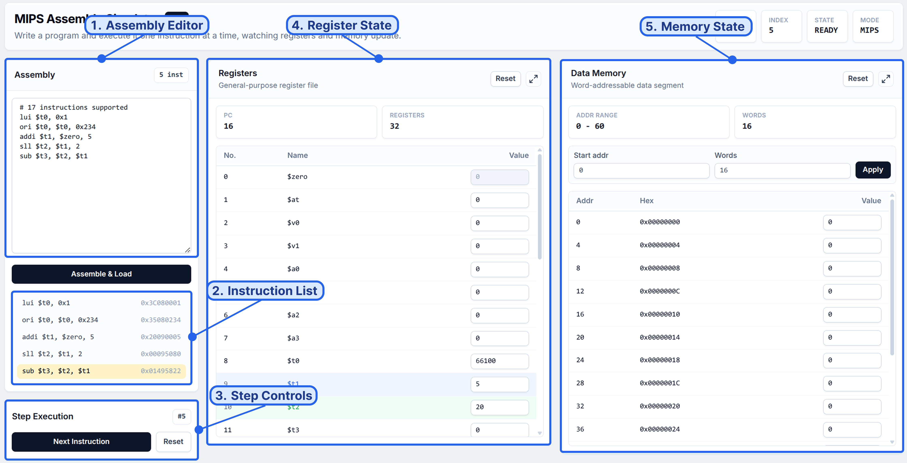

# CS2100 Visualizer

Interactive web app for learning CS2100 topics through visual simulation: MIPS datapath execution, MIPS assembly, Karnaugh maps, and planned pipeline instruction flow.

## Demo

[CS2100 Visualizer Demo](https://cs2100-visualizer.vercel.app/)

## Proposed Level of Achievement

Target: **Apollo 11**

---

# 1. Motivation

CS2100 introduces important computer organization concepts such as MIPS assembly, single-cycle datapath execution, control signals, register and memory updates, Boolean simplification, and pipelining. These concepts are often taught through static diagrams and tables.

However, static diagrams do not show how values move through the processor, how control signals affect datapath routing, or how intermediate values change step by step. For example, students may know that `lw` uses `ALUSrc`, `MemRead`, `MemToReg`, and `RegWrite`, but still struggle to visualize how the immediate becomes an address, how data memory is read, and how the result is written back to the register file.

Similarly, for Karnaugh maps, students may be able to see the final simplified expression, but still not fully understand why certain groups are valid, why groups wrap around, or how a group becomes a Boolean term.

CS2100 Visualizer aims to make these hidden processes visible. Instead of only reading diagrams, students can interact with instructions, signals, memory, registers, K-map cells, groups, and solver output directly.

---

# 2. Vision

CS2100 Visualizer is intended to become a unified learning tool for core CS2100 topics.

The current app focuses on three learning modules:

1. **MIPS Datapath Visualizer** — helps students understand single-cycle datapath execution.
2. **MIPS Assembly Simulator** — helps students write and execute MIPS assembly programs.
3. **K-map Visualizer** — helps students practise Boolean simplification.

The planned pipeline module will focus on **instruction flow across cycles**, showing stalls, bubbles, hazards, and forwarding in a timeline format. It is not intended to be a full visual pipeline datapath diagram.

The long-term goal is to create a tool where students can learn by stepping, inspecting, editing, comparing, and experimenting.

---

# 3. Target Users

## 3.1 Primary Users

The primary users are **CS2100 students** learning:

* MIPS instructions
* single-cycle datapath
* control signals
* register and memory behavior
* assembly execution
* Karnaugh maps
* pipeline concepts

## 3.2 Secondary Users

Secondary users include:

* tutors and teaching assistants
* students revising before exams
* students who prefer visual learning
* learners who want quick concept checking

## 3.3 User Needs

Students need a tool that helps them:

* see how data moves through hardware
* observe intermediate values, not just final outputs
* connect assembly code to machine state
* understand how control signals affect execution
* practise K-map simplification interactively
* learn from mistakes through logs, warnings, and feedback

---

# 4. User Stories

## 4.1 Datapath Visualizer

* As a CS2100 student, I want to step through IF/ID/EX/MEM/WB so that I can understand what each stage does.
* As a CS2100 student, I want active datapath wires to be highlighted so that I can trace data movement.
* As a CS2100 student, I want to inspect values inside components so that I can understand what each component receives and outputs.
* As a CS2100 student, I want to edit control signals so that I can see how incorrect signals affect execution.
* As a CS2100 student, I want execution logs and warnings so that I can understand unexpected behavior.
* As a tutor, I want a visual tool that helps explain datapath execution during teaching.

## 4.2 Assembly Simulator

* As a CS2100 student, I want to write MIPS assembly and assemble it into machine code.
* As a CS2100 student, I want to step through instructions one at a time.
* As a CS2100 student, I want to see PC, register, and memory updates after each instruction.
* As a CS2100 student, I want labels in branches and jumps to be resolved correctly.
* As a learner, I want register and memory highlights so that I can see which values are read and written.

## 4.3 K-map Visualizer

* As a CS2100 student, I want to edit K-map cells so that I can create Boolean functions.
* As a CS2100 student, I want to use 2-variable, 3-variable, and 4-variable K-maps.
* As a CS2100 student, I want to manually group cells so that I can practise simplification.
* As a CS2100 student, I want to compare my groups with solver groups.
* As a CS2100 student, I want to check whether my Boolean expression is correct.
* As a CS2100 student, I want practice maps with different difficulty levels.

## 4.4 Pipeline Instruction Flow Visualizer

* As a CS2100 student, I want to see instructions move across pipeline stages over cycles.
* As a CS2100 student, I want stalls and bubbles to be clearly shown.
* As a CS2100 student, I want hazards and forwarding to be visualized in a timeline.
* As a CS2100 student, I want to understand pipeline behavior without needing to mentally track every stage manually.

---

# 5. Scope of Project

## 5.1 Current Modules

### MIPS Datapath Visualizer

A staged single-cycle datapath learning tool. It focuses on instruction execution through IF, ID, EX, MEM, and WB, with control signals, active paths, machine state, logs, warnings, and component inspection.

### MIPS Assembly Simulator

A separate instruction-level assembly simulator. It focuses on writing supported MIPS programs, assembling them into machine code, and executing them instruction by instruction.

### K-map Visualizer

A Boolean simplification practice tool. It focuses on K-map editing, manual grouping, solver comparison, expression checking, and practice generation.

## 5.2 Planned Modules

### Pipeline Instruction Flow Visualizer

A planned timeline-based visualizer that shows instruction flow across cycles. It will focus on IF/ID/EX/MEM/WB stage placement, stalls, bubbles, hazards, and forwarding.

This module is not intended to be a full pipeline datapath renderer.

### Cache Visualizer

A planned future module for visualizing cache hits, misses, replacement, memory blocks, and locality.

---

# 6. Feature Status Summary

| Feature                      | Status                | Notes                                                        |
| ---------------------------- | --------------------- | ------------------------------------------------------------ |
| MIPS Datapath Visualizer     | Implemented           | Stage-by-stage single-cycle datapath execution               |
| Editable Control Signals     | Implemented           | Users can override runtime control signals                   |
| Component Inspector          | Implemented           | Supports major datapath components and MUXes                 |
| Register / Memory Simulation | Implemented           | Supports editable state and simulation mode                  |
| Execution Logs and Warnings  | Implemented           | Explains stage behavior and invalid signal cases             |
| MIPS Assembly Simulator      | Implemented           | Supports parsing, label resolution, hex output, and stepping |
| K-map Visualizer             | Implemented           | Supports editing, grouping, solver comparison, and practice  |
| Automated Tests              | Implemented           | Uses Vitest for MIPS and K-map core logic                    |
| Pipeline Instruction Flow    | Planned / In progress | Focus on timeline, stalls, bubbles, and hazards              |
| Cache Visualizer             | Future work           | Not part of current milestone                                |

---

# 7. Features

## 7.1 MIPS Datapath Visualizer

### Proposed

The datapath visualizer should help students understand how MIPS instructions are executed in a single-cycle datapath.

It should show:

* instruction fields
* control signals
* active datapath wires
* stage-by-stage execution
* register and memory updates
* component-level values
* warnings for invalid control behavior

### Current Progress

The current datapath tab renders an SVG-based single-cycle MIPS datapath.

Supported datapath instructions:

```txt
add, addi, and, beq, bne, lw, slt, or, sw, sub
```

Execution stages:

```txt
IF, ID, EX, MEM, WB
```

Datapath modes:

* **Explore**: inspect paths and signals without committing state changes.
* **Simulate**: apply PC, register, and memory updates.
* **Assembly**: load a small assembly program using the datapath-supported instruction subset and execute it stage by stage.

Current implemented UI features:

* instruction setup
* command/status header
* control-signal table
* editable control signals
* step controls
* previous/reset support
* register table
* memory table
* datapath value table
* execution log
* warnings panel
* component inspector
* dynamic SVG wire highlighting

### Screenshot / Demo


---

## 7.2 MIPS Assembly Simulator

### Proposed

The assembly simulator should let students write MIPS code, assemble it into machine code, and step through execution.

It should help students connect:

* assembly source
* decoded instruction fields
* machine code
* PC/register/memory changes

### Current Progress

The Assembly tab supports the currently implemented 17-instruction set:

```txt
add, addi, and, andi, beq, bne, j, lui, lw, nor, or, ori, slt, sll, srl, sw, sub
```

Current implemented features:

* assembly text input
* parser
* label handling
* branch and jump target resolution
* 32-bit hex machine-code output
* instruction-level stepping
* PC updates
* register updates
* memory updates
* input/output highlighting
* reset after loading

### Screenshot / Demo




---

## 7.3 K-map Visualizer

### Proposed

The K-map visualizer should help students practise Boolean simplification interactively.

It should support:

* 2-variable, 3-variable, and 4-variable K-maps
* minterms and don't-cares
* manual grouping
* solver grouping
* expression checking
* practice generation

### Current Progress

Current K-map features:

* 2-variable K-map
* 3-variable K-map
* 4-variable K-map
* editable `0 / 1 / X` cells
* minterm input
* don't-care input
* Boolean expression input
* SOP/POS modes
* manual grouping workflow
* solver grouping view
* expression checker
* practice-map generation
* tests for K-map logic

### Screenshot / Demo


The annotated K-map screenshot should label:

* variable selector
* SOP/POS mode
* minterm input
* K-map grid
* manual groups
* solver groups
* expression checker
* practice generator

### Future Work

Future improvements include:

* step-by-step solver explanation
* improved overlapping group visualization
* more guided practice modes
* more common CS2100-style examples
* user testing on common K-map mistakes

---

## 7.4 Pipeline Instruction Flow Visualizer

### Proposed

The pipeline visualizer will focus on **instruction flow over cycles**, not a full visual pipeline datapath.

It should show:

* cycle-by-cycle instruction timeline
* IF/ID/EX/MEM/WB stage placement
* stalls
* bubbles
* data hazards
* control hazards
* forwarding where feasible

Example display goal:

```txt
Cycle:      1    2    3    4    5    6
lw          IF   ID   EX   MEM  WB
add              IF   ID   stall EX   MEM
```

### Current Progress

This module is not fully implemented yet.

For Milestone 2, the focus is to define and begin the timeline-based model:

* instruction list
* cycle table
* stall/bubble representation
* hazard explanation

### Future Work

Future work includes:

* pipeline timeline table
* hazard detection
* stall/bubble visualization
* forwarding explanation
* example programs

---

# 8. Technical Proof of Concept

The technical proof of concept demonstrates that the essential parts of the project are integrated.

For the datapath visualizer, the PoC shows:

1. selecting a supported MIPS instruction
2. generating default control signals
3. stepping through IF/ID/EX/MEM/WB
4. highlighting active datapath paths
5. updating datapath values, registers, memory, logs, and warnings
6. editing control signals
7. inspecting datapath components

For the assembly simulator, the PoC shows:

1. writing supported MIPS assembly
2. assembling into machine code
3. resolving labels
4. stepping through instruction execution
5. updating PC/register/memory state

For the K-map visualizer, the PoC shows:

1. editing K-map values
2. inputting minterms, don't-cares, or expressions
3. creating manual groups
4. comparing against solver groups
5. checking simplified expressions

This proves that the project is more than a static UI. It contains working simulation logic, interactive visualization, automated testing, and correctness-sensitive data transformations.

---

# 9. System Design

This section explains how the main modules are organized and how data flows through the system.

CS2100 Visualizer is a client-side React application. The app does not currently use a backend server or database. Each learning module has its own page-level UI and state management, while correctness-sensitive logic is kept in `core/` folders so it can be tested independently.

## 9.1 Overall Architecture

The app is split into three implemented learning modules:

* **Datapath Visualizer**
* **Assembly Simulator**
* **K-map Visualizer**

Each module has its own page and workflow, but they share the same general structure:

```txt
User interaction
→ feature page / hook state
→ core logic
→ visual output
```


The overall architecture diagram should show:

```txt
CS2100 Visualizer
├── React App Shell
│   └── App.tsx + tab navigation
│
├── Datapath Visualizer
│   ├── DatapathPage
│   ├── useDatapathSimulator
│   ├── core/mips/single-cycle
│   └── SVG + tables + logs + inspector
│
├── Assembly Simulator
│   ├── AssemblyPage
│   ├── useAssemblySimulator
│   ├── core/mips/assembly
│   ├── core/mips/execution
│   └── editor + machine code + registers + memory
│
└── K-map Visualizer
    ├── KMapPage
    ├── core/kmap
    └── grid + grouping + solver feedback
```

This separation keeps the UI layer independent from the simulation and solving logic.

---

## 9.2 Datapath Visualizer Design

The datapath visualizer is designed around staged single-cycle execution.

Users can interact with the datapath in three modes:

* **Explore Mode**: preview datapath behavior without committing machine-state updates.
* **Simulate Mode**: execute stages and commit PC, register, and memory updates.
* **Assembly Mode**: load a small assembly program using the datapath-supported instruction subset and execute it stage by stage.


## 9.3 Assembly Simulator Design

The assembly simulator is a separate instruction-level module. It focuses on program input, parsing, assembly, and step-by-step execution.

Unlike the datapath page, the assembly page does not show IF/ID/EX/MEM/WB stages. Instead, it executes one complete instruction per step.


---

## 9.4 K-map Visualizer Design

The K-map visualizer is designed around two learning paths:

* **manual solving**, where users create their own groups and expressions
* **solver comparison**, where the app generates correct groups and results

The goal is not only to give the final answer, but also to help students understand how grouping and simplification work.


The K-map design diagram should show this structure:

```txt
User Input
cells / minterms / don't-cares / expression
        │
        ▼
K-map Model
variables, cells, 0 / 1 / X values
        │
        ├── Manual Grouping
        │   selected cells
        │   validate group
        │   convert group to term
        │
        └── Auto Solver
            generate prime implicants
            find essential prime implicants
            choose final cover
                    │
                    ▼
Expression Checker
compare user answer with solver result
                    │
                    ▼
UI Feedback
group highlights, simplified expression, errors
```

This design shows that the K-map module contains real solving logic, not just a visual grid. It supports manual grouping, automatic solver output, expression checking, and practice generation.

---

## 9.5 Pipeline Instruction Flow Design

The pipeline module is planned as a timeline-based visualizer. It is intended to show **instruction flow across cycles**, not a full graphical pipeline datapath.

The focus is on:

* instruction timeline
* IF / ID / EX / MEM / WB placement
* stalls
* bubbles
* data hazards
* control hazards
* forwarding where feasible


The pipeline design diagram should show:

```txt
Instruction Program
lw, add, sw, beq...
        │
        ▼
Dependency Analysis
read/write registers
        │
        ▼
Hazard Detection
data hazards / control hazards
        │
        ▼
Pipeline Scheduler
assign stage to cycle
        │
        ▼
Stall / Bubble Logic
insert idle cycles
        │
        ▼
Forwarding Display
show bypass where possible
        │
        ▼
Timeline View
cycle-by-cycle pipeline table
```

Example intended output:

```txt
Cycle:  1    2    3     4    5    6
lw      IF   ID   EX    MEM  WB
add          IF   ID    ST   EX   MEM
```

This clarifies that the pipeline feature is about timing and instruction flow, not drawing another full datapath diagram.

---

## 9.6 Design Boundaries

The project follows these design boundaries:

* The app is currently fully client-side.
* There is no backend server or database.
* Each learning module has a separate page and workflow.
* Core logic is separated from UI rendering.
* Reusable MIPS logic is shared where appropriate between the datapath and assembly modules.
* K-map solving logic is separated from the K-map UI.
* Browser state is enough for the current scope because the app does not require accounts, saved progress, or shared classroom data.

A backend or database may be considered only if future versions add persistent user progress, saved exercises, accounts, or classroom sharing.

---

# 10. Code Structure

```txt
src/
  App.tsx
  components/
    layout/
    shared/
  core/
    kmap/
    mips/
      assembly/
      execution/
      instruction/
      single-cycle/
  features/
    assembly/
    datapath/
    kmap/
  types/
  utils/
public/
  screenshots/
docs/
  assets/
  diagrams/
```

Important files:

* `src/App.tsx` — top-level app shell and tab switching.
* `src/features/datapath/DatapathPage.tsx` — main datapath visualizer UI.
* `src/features/datapath/hooks/useDatapathSimulator.ts` — datapath state, stepping, modes, control signals, and machine state.
* `src/features/datapath/components/DatapathDiagram.tsx` — datapath SVG wrapper and highlight mapping.
* `src/features/datapath/components/StaticDatapathSvg.tsx` — static SVG datapath drawing and clickable hit boxes.
* `src/features/assembly/AssemblyPage.tsx` — standalone assembly simulator UI.
* `src/features/assembly/useAssemblySimulator.ts` — instruction-level assembly simulation state.
* `src/features/kmap/KMapPage.tsx` — K-map visualizer UI.
* `src/core/mips/assembly/` — MIPS parsers and assemblers.
* `src/core/mips/execution/` — instruction-level MIPS execution logic.
* `src/core/mips/instruction/` — instruction metadata, register names, encoders, and examples.
* `src/core/mips/single-cycle/` — datapath control, execution, diagram paths, highlights, inspector logic, and machine state.
* `src/core/kmap/` — K-map model, solver, practice generator, and manual group analysis.

---

# 11. Key Design Decisions

## 11.1 Separate Learning Modules

Datapath, Assembly, and K-map are separated because each module has a different learning workflow.

The datapath page focuses on staged hardware behavior. The assembly page focuses on instruction-level program execution. The K-map page focuses on Boolean simplification practice.

## 11.2 SVG for Datapath Rendering

SVG was chosen over Canvas because datapath components and wires can be named, styled, highlighted, and clicked individually.

This is useful for a fixed CS2100-style datapath because each wire and component has a stable meaning.

## 11.3 Signal-based Datapath Simulation

Control signals are represented explicitly so students can see how changing a signal changes datapath behavior.

This supports both correct execution and incorrect-signal exploration.

## 11.4 Logical Paths vs SVG Segments

Logical datapath paths are separated from SVG drawing segments.

For example, the simulator can refer to a high-level path such as `PC_TO_IM`, while the SVG renderer can expand that into multiple actual SVG line segments.

This keeps simulation logic separate from visual drawing details.

## 11.5 No Database for Current Scope

No database is used because the app does not currently need accounts, persistent progress, shared saved work, or server-side data.

The main workload is local simulation and visualization. A database may be considered later if the app adds saved user progress, classrooms, shared exercises, or persistent practice history.

---

# 12. Tech Stack

| Technology        | Purpose                         |
| ----------------- | ------------------------------- |
| React 19          | interactive UI                  |
| TypeScript        | typed simulator and data models |
| Vite              | build tooling                   |
| Tailwind CSS      | styling                         |
| SVG               | datapath rendering              |
| Vitest            | automated tests                 |
| ESLint / Prettier | code quality                    |

---

# 13. Testing Strategy

## 13.1 Automated Testing

Current tests cover:

* K-map model and solver logic
* K-map practice generation
* MIPS parsing and encoding
* label resolution
* instruction-level execution
* datapath step behavior
* invalid / undefined control signal behavior
* datapath path highlighting
* inspector output

Run tests:

```bash
npm test
```

Run watch mode:

```bash
npm run test:watch
```


## 13.2 Manual Testing

Manual workflows are used to check browser-visible behavior:

* SVG highlighting
* panel layout
* inspector interactions
* register edits
* memory edits
* full datapath stepping
* assembly program execution
* K-map grouping and expression checking

## 13.3 User Testing Plan

User testing is planned with CS2100 students.

Tasks:

* step through `add` or `lw`
* run an assembly program
* solve a K-map practice question
* compare manual K-map answer with solver output

Feedback to collect:

* ease of use
* confusing parts
* usefulness for learning
* bugs found
* suggested improvements

---

# 14. Timeline and Development Plan

## 14.1 Milestone 1 — MIPS Assembler/Interpreter and Datapath Visualizer Prototype

Completed:

* React app setup
* MIPS datapath visualizer
* assembly simulator
* step execution
* editable control signals
* inspector
* logs/warnings
* README, poster, video, project log

## 14.2 Milestone 2 — K-map Visualizer and Pipeline Instruction Flow

Main goals:

* K-map MVP
* K-map tests
* README expansion
* pipeline instruction flow design / prototype

Pipeline focus:

* instruction timeline
* stalls
* bubbles
* hazards
* forwarding concept

Not focused on:

* full pipeline datapath rendering

## 14.3 Milestone 3 — Validation, Polish, Cache, and Final Demo

Planned:

* user testing
* UI polish
* pipeline completion
* possible cache visualizer
* final documentation
* final poster/video/demo

---

# 15. Project Log

See the [Project Log](https://docs.google.com/spreadsheets/d/1A2_8V8NCeS0M-E4F1fd_surIe4hl_3G42rxcGUjya_Q/edit?gid=1842178055#gid=1842178055).
