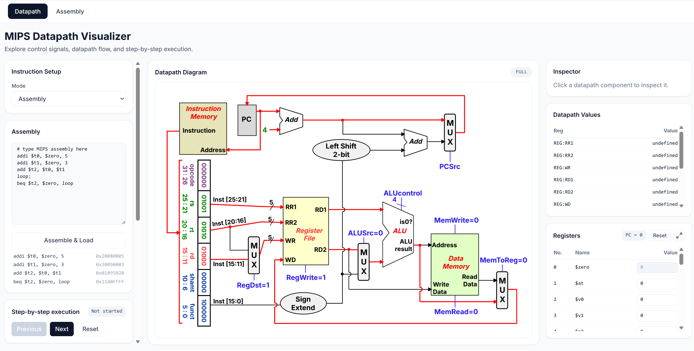
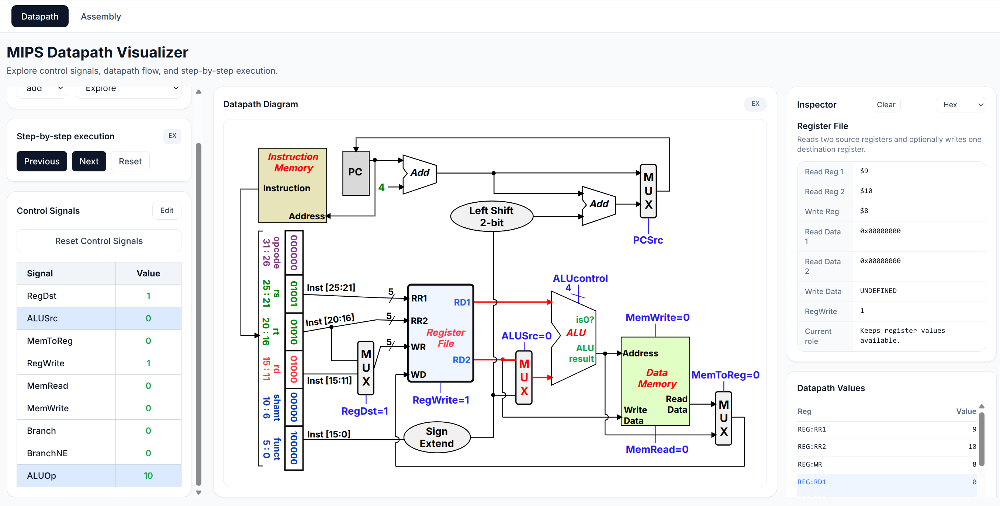

# CS2100 Visualizer

## Demo Link

The app is deployed here:

[CS2100 Visualizer Demo](https://cs2100-visualizer.vercel.app/)

## 1. Project Overview

CS2100 Visualizer is an interactive web app for learning MIPS datapath behavior, assembly execution, and related CS2100 topics through visualization.

The project currently contains two main modules:

1. **MIPS Datapath Visualizer** — an interactive single-cycle datapath tool where users can select supported datapath instructions, step through IF/ID/EX/MEM/WB stages, inspect control signals, and observe datapath values, registers, memory, logs, and warnings.

2. **MIPS Assembly Simulator** — a separate assembly simulation module where users can write a small MIPS program using the currently supported 17 MIPS instructions, assemble it into hex machine code, and execute it one instruction at a time while observing PC, register, and memory updates.

The project is built as a React + TypeScript + Vite application with Tailwind CSS and SVG-based datapath rendering.

## 2. Motivation

CS2100 concepts can be difficult to learn because many important ideas are abstract. Control signals, datapath routing, instruction fields, register updates, memory access, and stage-by-stage execution are usually shown as static diagrams.

A visual simulator makes these hidden state changes visible. By stepping through instructions and watching active datapath paths, control signals, logs, registers, and memory, students can connect MIPS instruction semantics to actual hardware behavior.

## 3. Target Users

* CS2100 students learning MIPS, datapath design, and instruction execution.
* Students revising MIPS assembly and single-cycle datapath behavior.
* Tutors or teaching assistants who want a visual aid for explaining datapath flow.

## 4. Level of Achievement

Target: Apollo 11.

For Milestone 1, the goal is to demonstrate a working technical proof of concept, especially for the core datapath visualizer. The current prototype already includes interactive datapath visualization, instruction stepping, editable control signals, register and memory simulation, component inspection, execution logs, warnings, and a separate assembly simulator.

To fully justify Apollo 11, the project still needs stronger software engineering practices, automated testing, user testing, and UI polish in later milestones.

## 5. Core Features

### 5.1 MIPS Datapath Visualizer

The datapath page renders an SVG-based single-cycle MIPS datapath. Active datapath segments are highlighted as users step through instruction execution, making it easier to see which values move through the PC, instruction memory, register file, ALU, data memory, MUXes, and write-back paths.

Supported datapath instructions are:

`add`, `addi`, `and`, `beq`, `bne`, `lw`, `slt`, `or`, `sw`, `sub`

The datapath page also includes an Assembly mode that can load and step through assembly programs, but this mode is limited to the datapath-supported instruction subset above.

### 5.2 Step-by-step Datapath Execution

Users can step through datapath execution stages:

`IF`, `ID`, `EX`, `MEM`, `WB`

Each step updates the visible datapath paths, datapath values, logs, warnings, and machine-state tables where applicable.

### 5.3 Editable Control Signals

The control-signal panel lets users inspect and edit runtime control signals. Users can override signals such as register write, memory read/write, ALU source, branch behavior, and related datapath controls, then compare the resulting active paths against the default signal behavior.

This allows students to observe how incorrect or undefined control signals affect datapath behavior.

### 5.4 Register and Memory Simulation

The simulator tracks the PC, register file, and data memory. In simulate mode, state-changing instructions update registers, memory, and PC state. Users can also edit register and memory values directly from the UI.

### 5.5 Component Inspector

Users can click datapath components to inspect current values and signal-related information. The inspector currently supports datapath elements such as the PC, instruction memory, instruction register, ALU, register file, data memory, and MUXes.

### 5.6 Execution Logs and Warnings

The datapath page includes an execution log panel. Logs describe what happens during the current stage, while warnings surface invalid or unexpected signal behavior, including undefined `X` signal behavior.

### 5.7 MIPS Assembly Simulator

The assembly page is a separate module from the datapath visualizer. It lets users write supported MIPS assembly, assemble and load a program with labels, view each instruction's 32-bit hex machine code, and execute it one instruction at a time.

The assembly simulator supports the currently implemented 17-instruction set. It updates PC, registers, and memory after each instruction, and highlights related machine-state values: input registers/memory in blue and output registers/memory in green.

Supported assembly mnemonics are:

`add`, `addi`, `and`, `andi`, `beq`, `bne`, `j`, `lui`, `lw`, `nor`, `or`, `ori`, `slt`, `sll`, `srl`, `sw`, `sub`

## 6. Technical Proof of Concept

For Milestone 1, we reused our Liftoff poster and video as the high-level project pitch. The detailed technical proof of concept is documented here in the README.

Our current proof of concept demonstrates the core datapath visualizer workflow:

1. Users can select a supported MIPS instruction.
2. The app generates the corresponding default control signals.
3. Users can step through IF, ID, EX, MEM, and WB.
4. Active datapath wires are highlighted dynamically.
5. Register, memory, PC, datapath values, logs, and warnings update during execution.
6. Users can edit control signals and observe how changed signals affect datapath behavior.
7. Users can click datapath components such as PC, instruction memory, instruction register, ALU, register file, data memory, and MUXes to inspect current values.

This shows that the essential parts of the system are integrated: instruction representation, control signal modeling, staged datapath execution, SVG visualization, machine-state updates, logs, warnings, and component inspection.

### Proof-of-Concept Demo


### Proof-of-Concept Screenshots





## 7. System Architecture

The project is organized around two main feature modules:

1. **Datapath Visualizer**
2. **Assembly Simulator**

Both modules share core MIPS logic where appropriate, but they have separate UI flows.

### 7.1 Datapath Visualizer Flow

`UI -> useDatapathSimulator hook -> single-cycle simulator -> SVG/table/log output`

* UI components collect user actions such as instruction selection, mode changes, step controls, control-signal edits, register edits, memory edits, and component inspection.
* `useDatapathSimulator` coordinates UI state with simulator state, selected instruction, control signals, current step, warnings, logs, and highlighted datapath paths.
* Core single-cycle modules handle control-signal defaults, datapath execution, machine state, highlight calculation, inspector logic, and diagram path mapping.
* Outputs are rendered as the SVG datapath diagram, register table, memory table, datapath value table, inspector panel, control-signal table, execution logs, and warnings.

### 7.2 Assembly Simulator Flow

`Assembly source -> parser/assembler -> instruction-level simulator -> register/memory/output view`

* Users enter MIPS assembly in the assembly page.
* The assembler parses the supported 17-instruction set, resolves labels, and produces 32-bit machine-code words.
* The instruction-level simulator executes the program one instruction at a time.
* PC, registers, memory, generated hex code, and input/output highlights are updated after execution.

## 8. Code Structure

```txt
src/
  App.tsx
  core/
    mips/
      assembly/
      execution/
      instruction/
      single-cycle/
  features/
    assembly/
    datapath/
  components/
    layout/
    shared/
  types/
  utils/
public/
  screenshots/
```

Important files:

* `src/App.tsx` — switches between the Datapath and Assembly tabs.
* `src/features/datapath/DatapathPage.tsx` — main datapath visualizer page.
* `src/features/datapath/hooks/useDatapathSimulator.ts` — state and behavior for datapath stepping, control signals, datapath Assembly mode, and machine state.
* `src/features/datapath/components/DatapathDiagram.tsx` — SVG datapath rendering.
* `src/features/assembly/AssemblyPage.tsx` — standalone assembly simulator page.
* `src/features/assembly/useAssemblySimulator.ts` — instruction-level assembly simulation state.
* `src/core/mips/assembly/` — parsers and assemblers.
* `src/core/mips/execution/` — shared MIPS execution logic.
* `src/core/mips/instruction/` — instruction metadata, fields, and encoding.
* `src/core/mips/single-cycle/` — single-cycle datapath control, execution, diagram paths, highlights, and inspector logic.

## 9. Important Design Decisions

* **Separate datapath and assembly surfaces:** The datapath visualizer focuses on staged hardware visualization, while the Assembly tab focuses on instruction-level program execution.
* **Different instruction scopes:** The standalone Assembly tab supports all 17 currently implemented MIPS instructions, while the datapath visualizer supports only the instruction subset represented in the single-cycle datapath UI.
* **Signal-based datapath simulator:** Control signals are modeled explicitly and drive datapath behavior.
* **`X` signal behavior:** Undefined or invalid signal combinations can produce `X` values instead of being silently hidden.
* **Logical paths vs SVG paths:** SVG drawing paths are separated from logical datapath paths, so visual highlighting can change without rewriting simulator logic.
* **Explore vs Simulate modes:** Explore lets users experiment with signals without committing machine-state updates, while Simulate applies PC, register, and memory changes.
* **Component inspector:** Datapath components can be inspected independently so students can understand what each component owns and outputs.

## 10. Tech Stack

* React 19
* TypeScript
* Vite
* Tailwind CSS
* SVG
* ESLint
* Prettier dependency is present in `package.json`

## 11. Software Engineering Practices

Current practices:

* The repository includes configured scripts for development, production build, preview, and linting.
* ESLint configuration is present.
* Prettier is listed as a development dependency.
* Code is separated into core logic, feature modules, shared components, and type definitions.

Planned improvements:

* Add clearer GitHub workflow documentation.
* Use issues/milestones to track feature work.
* Add PR templates and issue templates.
* Add automated tests and CI in later milestones.

## 12. Testing Strategy

There is currently no automated test runner or `npm test` script configured in `package.json`.

Current testing is mainly manual testing of datapath and assembly simulator workflows, including instruction stepping, hex encoding display, register updates, memory updates, and highlighting behavior.

Testing work that should be added later:

* Unit tests for assembly parsing and label resolution.
* Unit tests for instruction execution and datapath step behavior.
* Unit tests for control-signal behavior, including invalid or undefined `X` cases.
* Integration tests for the datapath simulator hook.
* UI or end-to-end tests for instruction stepping, assembly loading, register updates, memory updates, and warning display.
* User testing with CS2100 students or tutors to check whether the visualization improves understanding.

## 13. Setup Instructions

Install dependencies:

```bash
npm install
```

Run the development server:

```bash
npm run dev
```

Open the local URL printed by Vite, usually:

```txt
http://localhost:5173
```

Build for production:

```bash
npm run build
```

Preview the production build:

```bash
npm run preview
```

Run linting:

```bash
npm run lint
```

## 14. Development Plan

### Milestone 1 — Datapath and Assembly Proof of Concept

Milestone 1 focuses on proving that the datapath visualizer and assembly simulator are feasible and usable.

Planned / current deliverables:

* Implement the SVG-based single-cycle datapath visualizer.
* Support instruction selection for the datapath-supported MIPS subset.
* Support IF/ID/EX/MEM/WB stepping.
* Show active datapath paths, datapath values, control signals, registers, memory, logs, and warnings.
* Add editable control signals and Explore/Simulate modes.
* Add component inspection for key datapath components.
* Add datapath Assembly mode for staged execution of datapath-supported assembly programs.
* Add a separate Assembly tab with parsing, label handling, hex machine-code output, and instruction-level execution for the supported 17-instruction set.
* Provide setup instructions, screenshots, poster, video, and project log.

### Milestone 2 — K-map and Pipelining

Milestone 2 focuses on expanding the project beyond single-cycle datapath and assembly simulation.

Planned work:

* Add Karnaugh-map visualization and simplification workflows.
* Add pipeline visualization for instruction flow across cycles.
* Show pipeline stage state, hazards, stalls, forwarding, and control behavior where feasible.
* Reuse existing MIPS parsing and execution logic where appropriate.
* Conduct early informal testing with CS2100 students or peers for the new modules.

### Milestone 3 — Reliability, Validation, and Polish

Milestone 3 focuses on testing, usability, and final project quality.

Planned work:

* Add automated tests for parser, instruction execution, control signals, datapath behavior, and assembly highlighting.
* Add integration or end-to-end tests for key workflows.
* Improve responsive UI layout and accessibility.
* Add user testing with CS2100 students or tutors.
* Improve execution logs, warnings, and explanations.
* Prepare final poster, video, and demo.

## 15. Future Work

* Additional MIPS instructions beyond the currently supported 17-instruction set.
* Broader staged datapath support for assembly programs beyond the current datapath subset.
* Pipeline visualization.
* Cache behavior visualization.
* Karnaugh-map tooling.
* More tutorial-style examples for common CS2100 concepts.

## 16. Project Log

See our [Project Log](https://docs.google.com/spreadsheets/d/1A2_8V8NCeS0M-E4F1fd_surIe4hl_3G42rxcGUjya_Q/edit?gid=1842178055#gid=1842178055).
